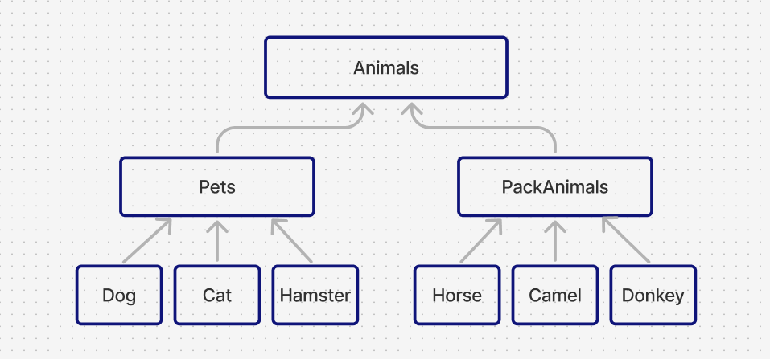

# Итоговая аттестация
## Информация о проекте
Необходимо организовать систему учета для питомника, в котором живут
домашние и вьючные животные.

#### 1 Используя команду cat в терминале операционной системы Linux, создать два файла Домашние животные (заполнив файл собаками, кошками, хомяками) и Вьючные животными заполнив файл Лошадьми, верблюдами и ослы), а затем объединить их. Просмотреть содержимое созданного файла. Переименовать файл, дав ему новое имя (Друзья человека).
Создание файла "Домашние животные" (Pets)
```
lr@lr-VirtualBox:~$ cat > Pets.txt
Dog
Cat
Hamster  
```
Создание файла "Вьючные животные" (PackAnimals)
```
lr@lr-VirtualBox:~$ cat > PackAnimals.txt
Horse
Camel
Donkey
```
Объединение файлов в новый файл Animals.txt
```
lr@lr-VirtualBox:~$ cat Pets.txt PackAnimals.txt > Animals.txt
```
Проверка содержимого объединенного файла
```
lr@lr-VirtualBox:~$ cat Animals.txt
Dog
Cat
Hamster
Horse
Camel
Donkey
```
Переименование файла в "Друзья человека" (HumanFriends)
```
lr@lr-VirtualBox:~$ mv Animals.txt HumanFriends.txt
```
#### 2 Создать директорию, переместить файл туда.
Создание директории
```
lr@lr-VirtualBox:~$ mkdir AnimalsDir
```
Перемещение файла в новую директорию
```
lr@lr-VirtualBox:~$ mv HumanFriends.txt AnimalsDir/
```
Проверка перемещения файла в директорию AnimalsDir
```
lr@lr-VirtualBox:~$ ls AnimalsDir

HumanFriends.txt
```
#### 3 Подключить дополнительный репозиторий MySQL. Установить любой пакет из этого репозитория.
Подключение репозитория MySQL:
```
lr@lr-VirtualBox:~$ sudo wget https://dev.mysql.com/get/mysql-apt-config_0.8.22-1_all.deb
lr@lr-VirtualBox:~$ sudo dpkg -i mysql-apt-config_0.8.22-1_all.deb
```
Установка пакета из репозитория MySQL и проверка статуса установленного пакета:
```
lr@lr-VirtualBox:~$ sudo apt update
lr@lr-VirtualBox:~$ sudo apt install mysql-server
lr@lr-VirtualBox:~$ sudo systemctl status mysql
```
#### 4 Установить и удалить deb-пакет с помощью dpkg.
Загрузка .deb пакета cowsay:
```
lr@lr-VirtualBox:~$ sudo wget http://mirrors.kernel.org/ubuntu/pool/universe/c/cowsay/cowsay_3.03+dfsg2-7_all.deb
```
Установка пакета с помощью dpkg:
```
lr@lr-VirtualBox:~$ sudo dpkg -i cowsay_3.03+dfsg2-7_all.deb
```
Проверка установки пакета cowsay:
```
lr@lr-VirtualBox:~$ cowsay "Hello, world!"

 _______________

< Hello, world! >

 ---------------

        \   ^__^

         \  (oo)\_______

            (__)\       )\/\

                ||----w |

                ||     ||

```
Удаление пакета cowsay с помощью dpkg:
```
lr@lr-VirtualBox:~$ sudo dpkg -r cowsay
```
#### 5 Выложить историю команд в терминале ubuntu

```
  1 sudo apt update
  2  cat > Pets.txt
  3  cat Pets.txt
  4  cat > PackAnimals.txt
  5  cat PackAnimals.txt
  6  cat Pets.txt PackAnimals.txt > Animals.txt
  7  cat Animals.txt
  8  mv Animals.txt HumanFriends.txt
  9  cat HumanFriends.txt
  10  ls
  11  mkdir AnimalsDir
  12  mv HumanFriends.txt AnimalsDir/
  13  ls AnimalsDir
  14  sudo apt update
  15  sudo wget https://dev.mysql.com/get/mysql-apt-config_0.8.22-1_all.deb
  16  sudo dpkg -i mysql-apt-config_0.8.22-1_all.deb
  17  sudo apt update
  18  sudo apt install mysql-server
  19  sudo systemctl status mysql
  20  sudo wget http://mirrors.kernel.org/ubuntu/pool/universe/c/cowsay/cowsay_3.03+dfsg2-7_all.deb
  21  sudo dpkg -i cowsay_3.03+dfsg2-7_all.deb
  22  cowsay "Hello, world!"
  23  sudo dpkg -r cowsay
  24  history | tail -n 24


```
#### 6 Нарисовать диаграмму, в которой есть класс родительский класс, домашние животные и вьючные животные, в составы которых в случае домашних животных войдут классы: собаки, кошки, хомяки, а в класс вьючные животные войдут: лошади, верблюды и ослы).



